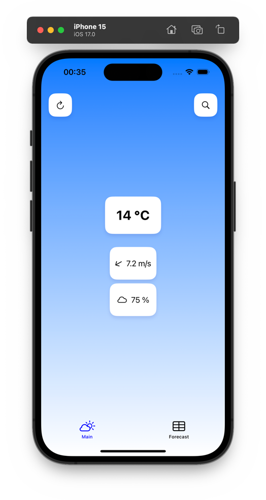
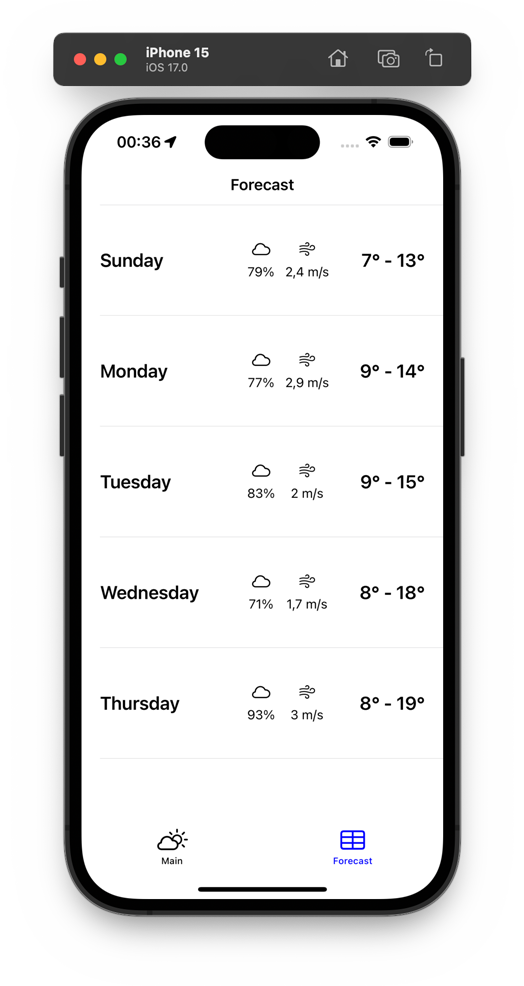

# Приложение погоды

<div align="center">
    
</div>


Приложение имеет расширяемую реактивную _Redux-like_ архитектуру, я применяю верстку как на **UIKit**, так и на **SwiftUI**. Для обеспечения реактивности различных делегатов, таких как из _CoreLocation_ и тд, я использую **Combine**. Сетевой слой написан с использованием Combine.

<div style="display: flex; flex-direction: row; flex-wrap: wrap; justify-content: center; column-gap: 24px; row-gap: 20px;">
  
  
</div>

## git

Была использована стандартная ветвная стратегия, аналогичная принятой практике во многих IT-компаниях. Ветвь `dev` служила основным местом для разработки функциональности. Это позволяло поддерживать чистоту и стабильность основной ветви `main`.

## OpenAPI

Допустим у нас есть сервер, который предоставляет API, в нашем случае OpenWeather API, допустим бекенд поменялся и они выгружают новую версию спецификации **openapi.yaml**, в таком случае я могу сгенерировать новые response модели с помощью скрипта **gentypes.sh**

## Установка

Чтобы получать данные от OpenWeather API введите токен в **Network/APIConstants**:

```swift
static let token: String = "<appid>"
```

Архитектура также позволяет заменить `OpenWeatherWebRepository` на свой компонент, реализующий `WebRepository`, например `StubWeatherWebRepository`

## Структура проекта

```
WeatherVK
│
├── AppDelegate   <- @main
│
├── Network
│   ├── DTO
│   │   └── ...   <- Response types and mapping
│   ├── APIClient
│   ├── APIRouter
│   └── ...
│
├── Repository
│   └── WebRepository
│       └── ...
│
├── View
│   └── ...
│
├── Model
│   └── ...
│
│
├── WeatherReducer
├── AppState      <- Single Source of Trust
├── Environment   <- Bind for SwiftUI
│
├── Docs          <- openapi.yaml
└── ...           <- Resources and utility
```

## Технологии и инструменты

- [UIKit]()
- [SwiftUI](https://developer.apple.com/xcode/swiftui/)
- [Combine]()
- [Сетевой слой](https://danielbernal.co/writing-a-networking-library-with-combine-codable-and-swift-5/)
- [OpenWeather API](https://openweathermap.org)
- [CoreLocation]()
- [Postman](https://www.postman.com/)
- [SwiftLint](https://github.com/realm/SwiftLint)
