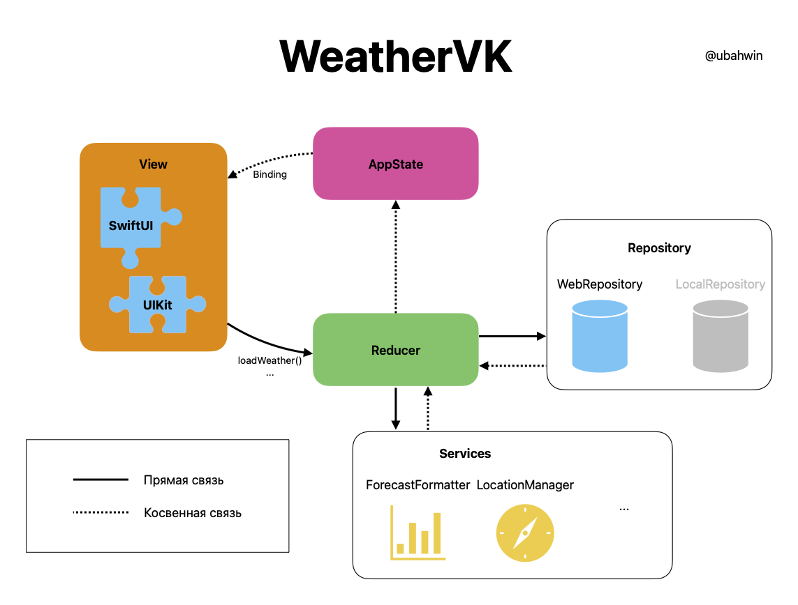

# Приложение погоды <!-- omit in toc -->

<!-- markdownlint-disable MD033 -->


<div align="center">
    
</div>

## Содержание <!-- omit in toc -->

- [Архитектура](#архитектура)
- [OpenAPI](#openapi)
- [Установка](#установка)
- [Структура проекта](#структура-проекта)
- [Стратегии разработки](#стратегии-разработки)
  - [SwiftLint](#swiftlint)
  - [Git Hooks](#git-hooks)
- [Старый дизайн](#старый-дизайн)
- [Технологии и инструменты](#технологии-и-инструменты)

Приложение имеет расширяемую _Redux-like_ архитектуру, я применяю верстку как на
**UIKit**, так и на **SwiftUI**. Для обеспечения реактивности различных
делегатов, таких как из `CoreLocation`, `MapKit` и т.д., я использую `Combine`.

Представлений два: одно на `UIKit`, другое – `SwiftUI`

Реализован поиск городов с помощью `MKLocalSearch`. Определение геопозиции
пользователя и названия города по координатам с помощью `CLGeocoder`. Сетевой
слой написан с использованием `Combine`.

С бесплатной версии OpenWeather API данные о погоде приходят только за последние
5 дней с интервалом в 3 часа. Поэтому эти данные обрабатываются в
`ForecastFormatter`'е, который покрыт Unit-тестами. Составляется выборка с
конкретными днями недели и данными.

<div style="display: flex; flex-direction: row; flex-wrap: wrap; justify-content: center; column-gap: 24px; row-gap: 20px;">
  
  
</div>

## Архитектура



Приложение поделено на слои-модули, общение между которыми происходит по
протоколам. `AppState` – single source of truth, он независим от других слоёв.
`Reducer` инкапсулирует бизнес-логику для представления. `Repository` – это
абстрактный шлюз для чтения/записи данных.

Подробнее об этом на моём сайте:
[https://ubahdev.ru/articles/clean-architecture-for-swiftui](https://ubahdev.ru/articles/clean-architecture-for-swiftui).

## OpenAPI

Была написана OpenAPI-спецификация на OpenWeather API в формате YAML:
[`docs/openapi.yaml`](docs/openapi.yaml). На основе этой спецификации работает
кодогенерация моделей ответов сервера с помощью инструмента
[OpenAPI Generator](https://openapi-generator.tech/) через самописный скрипт
[`gentypes.sh`](gentypes.sh).

## Установка

Необходимо вписать токен OpenWeather API в константу `token` в файле
[`Network/APIConstants.swift`](WeatherVK/Network/APIConstants.swift):

```swift
static let token: String = "<token>"
```

Архитектура также позволяет заменить `OpenWeatherWebRepository` на свой
компонент, реализующий `WebRepository`, например `StubWeatherWebRepository`.

## Структура проекта

<!-- markdownlint-disable MD040 -->

```
WeatherVK
├── AppDelegate     <- @main
├── Network
│   ├── DTO
│   │   └── ...     <- Response types and mapping
│   ├── APIClient
│   ├── APIRouter
│   └── ...
├── Repository
│   └── WebRepository
│       └── ...
├── View
│   └── ...
├── Model
│   └── ...
├── WeatherReducer
├── AppState        <- Single Source of Trust
├── Environment     <- Bind for SwiftUI
├── LocationManager <- Location detect
├── docs            <- openapi.yaml
└── ...             <- Resources and utility
```

<!-- markdownlint-enable MD040 -->

## Стратегии разработки

Разработка ведется на `dev`-ветке, переодически изменения вливаются в `main`. На
момент сдачи проекта актуальная версия на ветке `main`.

### SwiftLint

В Build Phases используется следующий Run Script, запускающий линтер
[SwiftLint](https://github.com/realm/SwiftLint) перед сборкой проекта:

```bash
if [[ "$(uname -m)" == arm64 ]]; then
    export PATH="/opt/homebrew/bin:$PATH"
fi

if which swiftlint >/dev/null; then
  swiftlint --strict --config ./.swiftlint.yml
else
  echo "error: SwiftLint does not exist"
  exit 1
fi
```

### Git Hooks

Для защиты токена был написан Git Hook pre-commit, который заменяет вхождения
токена в файле `Network/APIConstants.swift` на `<token>` перед выполнением
коммита.

Чтобы добавить этот Hook, выполните команды:

```bash
cd .git/hooks
ln -s ../../git_hooks/pre-commit
```

## Старый дизайн

Облака с информацией в главном меню можно двигать, также при тряске телефона они
немного меняют свою позицию, что делает приложение более живым — так я хотел
продемонстрировать свои навыки верстки. Стрелка показывает направление ветра,
даже если поменять ориентацию iPhone. Таблица сверстана на `UIKit` с
использованием `UITableView` без использования Storyboard. Главное меню – на
`SwiftUI`.

<div style="display: flex; flex-direction: row; flex-wrap: wrap; justify-content: center; column-gap: 24px; row-gap: 20px;">
  
  
</div>

## Технологии и инструменты

- [UIKit](https://developer.apple.com/documentation/uikit)
- [SwiftUI](https://developer.apple.com/xcode/swiftui/)
- [Combine](https://developer.apple.com/documentation/combine)
- [Сетевой слой](https://danielbernal.co/writing-a-networking-library-with-combine-codable-and-swift-5/)
- [OpenWeather API](https://openweathermap.org)
- [CoreLocation](https://developer.apple.com/documentation/corelocation)
- [MapKit](https://developer.apple.com/documentation/mapkit/)
- [SwiftLint](https://github.com/realm/SwiftLint)
- [OpenAPI Generator](https://openapi-generator.tech/)
